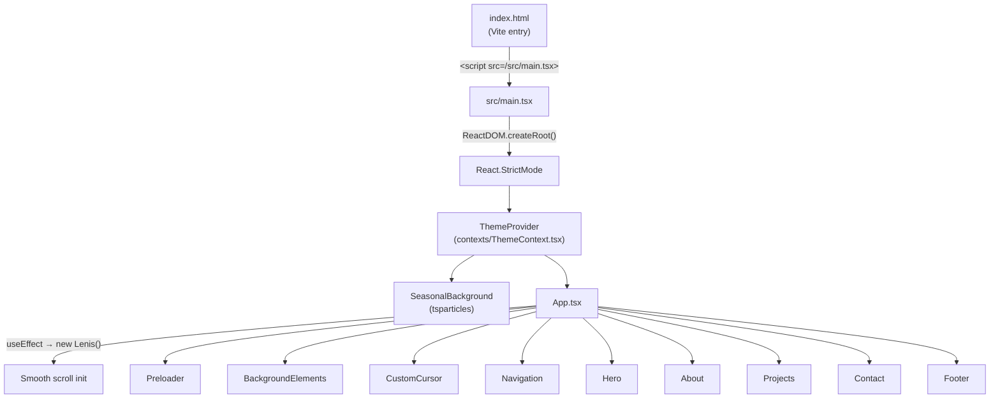
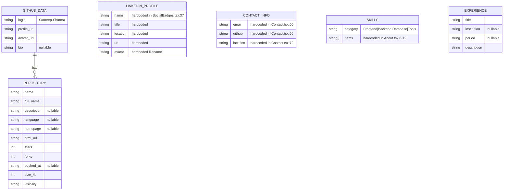
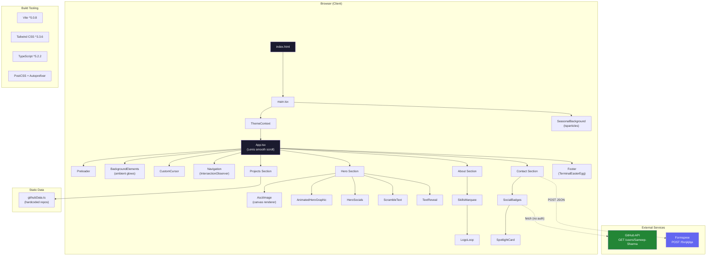

# ARCHITECTURE.md — Reverse Engineering Report

> Generated: 2026-06-26  
> Scope: Full codebase audit of `D:\Portfolio`

---

## 1. Repo Map

### Directory Tree (excluding `node_modules`, `.git`, `dist`)

```
D:\Portfolio/
├── .astro/                          # Astro build cache (vestigial)
├── .env.example                     # Env template
├── .gitignore
├── .vercelignore
├── ANIMATION_ENHANCEMENTS.md        # Design notes doc
├── README.md                        # Project readme (partially stale)
├── astro.config.mjs                 # Astro config (vestigial)
├── index.html                       # Vite SPA entry
├── package.json                     # Single package — monolith SPA
├── package-lock.json
├── postcss.config.js                # PostCSS → Tailwind + Autoprefixer
├── tailwind.config.js               # Tailwind v3 config
├── tsconfig.json                    # TypeScript config
├── tsconfig.node.json               # TS config for Vite tooling
├── update-theme.js                  # One-off Node script (color migration)
├── vite.config.ts                   # Vite dev/build config
├── public/
│   └── 6677af9b46a5b1d9d281897dee91b79d.jpeg   # Profile photo (~1 MB)
└── src/
    ├── main.tsx                     # React DOM entry point
    ├── App.tsx                      # Root app component + Lenis smooth scroll
    ├── index.css                    # Global styles + Tailwind layers
    ├── vite-env.d.ts                # Vite type declarations
    ├── components/                  # 23 React components (flat, no nesting)
    │   ├── About.tsx
    │   ├── AnimatedHeroGraphic.tsx
    │   ├── AppWrapper.tsx           # Astro adapter (vestigial)
    │   ├── AsciiImage.tsx
    │   ├── BackgroundElements.tsx
    │   ├── Contact.tsx
    │   ├── CustomCursor.tsx
    │   ├── Footer.tsx
    │   ├── Hero.tsx
    │   ├── HeroSocials.tsx
    │   ├── LogoLoop.tsx
    │   ├── MagicName.tsx
    │   ├── MagneticButton.tsx
    │   ├── Navigation.tsx
    │   ├── Preloader.tsx
    │   ├── Projects.tsx
    │   ├── ScrambleText.tsx
    │   ├── SeasonalBackground.tsx
    │   ├── SkillsMarquee.tsx
    │   ├── SocialBadges.tsx
    │   ├── SpotlightCard.tsx
    │   ├── TerminalEasterEgg.tsx
    │   └── TextReveal.tsx
    ├── contexts/
    │   └── ThemeContext.tsx          # Light/dark theme provider
    ├── data/
    │   └── githubData.ts            # Hardcoded project data
    ├── layouts/
    │   └── Layout.astro             # Astro layout (vestigial)
    └── pages/
        └── index.astro              # Astro page (vestigial)
```

### Services / Deploy Units

| # | Service | Type | Status |
|---|---------|------|--------|
| 1 | **Vite React SPA** | Client-side single-page application | **Active** — runs via `npm run dev` → Vite |
| 2 | **Astro SSR shell** | Static-site generator wrapping the React app | **Vestigial / Dead** — config exists but Vite is the active build tool |

This is a **single-service, client-only portfolio website**. There is no backend, no database, no API server. The only external data fetching happens at runtime via the GitHub public API.

---

## 2. Tech Stack Inventory

### Active Stack (Vite SPA)

| Layer | Technology | Version (from `package.json`) |
|-------|-----------|-------------------------------|
| Language | TypeScript | `^5.2.2` |
| UI Library | React | `^18.2.0` |
| Build Tool | Vite | `^5.0.8` |
| Vite Plugin | `@vitejs/plugin-react` | `^4.2.1` |
| CSS Framework | Tailwind CSS | `^3.3.6` |
| CSS Processing | PostCSS + Autoprefixer | `^8.4.32` / `^10.4.16` |
| Animation | Framer Motion | `^10.16.16` |
| Smooth Scroll | Lenis | `^1.3.18` |
| Icons | Lucide React | `^0.294.0` |
| Icons (brand) | React Icons | `^5.5.0` |
| Particles | `@tsparticles/react` + `@tsparticles/slim` | `^3.0.0` / `^3.9.1` |
| Carousel (listed) | `embla-carousel-react` | `^8.0.0` |
| Confetti | `canvas-confetti` | `^1.9.4` |
| reCAPTCHA (listed) | `react-google-recaptcha` | `^3.1.0` |
| Linting | ESLint + TS plugins | `^8.55.0` |

### Vestigial / Dead Dependencies

| Package | Status | Evidence |
|---------|--------|----------|
| `astro.config.mjs` | Dead config | Not in `package.json` deps; `astro` not installed |
| `embla-carousel-react` | Installed but **unused** | grep shows zero imports across src/ |
| `canvas-confetti` + `@types/canvas-confetti` | Installed but **unused** | grep shows zero imports across src/ |
| `react-google-recaptcha` + `@types/react-google-recaptcha` | Installed but **unused** | grep shows zero imports across src/ |

### Database(s)

None. This is a fully static, client-side application.

### Auth Strategy

None. There is no authentication or authorization — it is a public portfolio website.

---

## 3. Entry Points & Runtime Flow

### Startup Sequence



**Step-by-step:**

1. **`index.html`** ([index.html:14](file:///d:/Portfolio/index.html#L14)): Standard Vite SPA shell. Loads `/src/main.tsx` as a module.
2. **`main.tsx`** ([main.tsx:8-15](file:///d:/Portfolio/src/main.tsx#L8-L15)): Calls `ReactDOM.createRoot()`, wraps everything in `<ThemeProvider>`, renders `<SeasonalBackground />` and `<App />`.
3. **`ThemeContext.tsx`** ([ThemeContext.tsx:12-43](file:///d:/Portfolio/src/contexts/ThemeContext.tsx#L12-L43)): Reads theme from `localStorage`, falls back to `prefers-color-scheme`, toggles `dark` class on `<html>`.
4. **`SeasonalBackground.tsx`** ([SeasonalBackground.tsx:12-18](file:///d:/Portfolio/src/components/SeasonalBackground.tsx#L12-L18)): Initializes tsparticles engine, determines current season from `new Date().getMonth()`, renders themed particles.
5. **`App.tsx`** ([App.tsx:16-37](file:///d:/Portfolio/src/App.tsx#L16-L37)): Initializes Lenis smooth scrolling via `useEffect`, then renders all section components in order.

### Tracing the Core Feature: "Contact Form Submission"

This is the only interactive data flow in the entire app:

1. User fills out form in **`Contact.tsx`** ([Contact.tsx:174-251](file:///d:/Portfolio/src/components/Contact.tsx#L174-L251))
2. `handleSubmit` ([Contact.tsx:22-54](file:///d:/Portfolio/src/components/Contact.tsx#L22-L54)) fires on form submit
3. Sends `POST` to **Formspree** endpoint `https://formspree.io/f/xnjkjlqa` ([Contact.tsx:29](file:///d:/Portfolio/src/components/Contact.tsx#L29))
4. Request body: `{ name, email, message }` as JSON
5. On success → sets `status.succeeded = true`, clears form, shows confirmation
6. On error → sets `status.errors`, displays error messages

There is no backend processing — Formspree is a third-party form handler.

### Secondary Data Flow: GitHub Profile Fetch

**`SocialBadges.tsx`** ([SocialBadges.tsx:24](file:///d:/Portfolio/src/components/SocialBadges.tsx#L24)): Fetches `https://api.github.com/users/Sameep-Sharma` at mount time (no auth token). Displays repos/followers/following counts. Rate-limited to 60 req/hr for unauthenticated requests.

---

## 4. Data Model

There is **no database**. All data is either:

1. **Hardcoded** in source files
2. **Fetched at runtime** from external APIs

### Static Data Sources



### Runtime Data Sources

| Source | URL | Auth | Data Used |
|--------|-----|------|-----------|
| GitHub API | `https://api.github.com/users/Sameep-Sharma` | None (unauthenticated) | avatar, name, login, bio, public_repos, followers, following, location |
| Formspree | `https://formspree.io/f/xnjkjlqa` | None (public form ID) | Outbound only (name, email, message) |

---

## 5. API / Interface Surface

### External API Calls (Outbound)

| Method | URL | Auth | Request Shape | Response Shape | Called From |
|--------|-----|------|---------------|----------------|------------|
| `GET` | `https://api.github.com/users/Sameep-Sharma` | None | — | `GitHubProfile` (login, avatar_url, name, bio, public_repos, followers, following, location) | [SocialBadges.tsx:24](file:///d:/Portfolio/src/components/SocialBadges.tsx#L24) |
| `POST` | `https://formspree.io/f/xnjkjlqa` | None | `{ name: string, email: string, message: string }` | `{ ok: boolean, errors?: Array }` | [Contact.tsx:32-41](file:///d:/Portfolio/src/components/Contact.tsx#L32-L41) |

### Frontend Screens (Sections)

This is a **single-page application** with anchor-based navigation. All sections are rendered simultaneously.

| Section | Component | Anchor ID | Data Dependencies |
|---------|-----------|-----------|-------------------|
| Preloader | [Preloader.tsx](file:///d:/Portfolio/src/components/Preloader.tsx) | — | Timer (1200ms) |
| Navigation | [Navigation.tsx](file:///d:/Portfolio/src/components/Navigation.tsx) | — | Active section (IntersectionObserver), theme state |
| Hero | [Hero.tsx](file:///d:/Portfolio/src/components/Hero.tsx) | `#home` | None (static) |
| About | [About.tsx](file:///d:/Portfolio/src/components/About.tsx) | `#about` | Hardcoded skills & experience arrays |
| Projects | [Projects.tsx](file:///d:/Portfolio/src/components/Projects.tsx) | `#projects` | `githubData` prop from [githubData.ts](file:///d:/Portfolio/src/data/githubData.ts) |
| Contact | [Contact.tsx](file:///d:/Portfolio/src/components/Contact.tsx) | `#contact` | Formspree submission, hardcoded contact info |
| Footer | [Footer.tsx](file:///d:/Portfolio/src/components/Footer.tsx) | — | None (contains TerminalEasterEgg) |

### Ambient / Cross-Cutting Components

| Component | Purpose |
|-----------|---------|
| [BackgroundElements.tsx](file:///d:/Portfolio/src/components/BackgroundElements.tsx) | Mouse-tracking ambient glow orbs |
| [SeasonalBackground.tsx](file:///d:/Portfolio/src/components/SeasonalBackground.tsx) | tsparticles seasonal effects (snow/sakura/sun/leaves) |
| [CustomCursor.tsx](file:///d:/Portfolio/src/components/CustomCursor.tsx) | Custom cursor with magnetic snap to interactive elements |

---

## 6. Core Business Logic

Since this is a portfolio site, "business logic" = the non-trivial interactive behaviors.

### 6.1 Theme Persistence & Toggle
**Files:** [ThemeContext.tsx:12-43](file:///d:/Portfolio/src/contexts/ThemeContext.tsx#L12-L43)

Reads from `localStorage('theme')` first, then `prefers-color-scheme` media query. Applies `dark` CSS class to `document.documentElement`. Persists choice back to `localStorage` on every toggle. All components use Tailwind's `dark:` variant, which is configured as `darkMode: 'class'` in [tailwind.config.js:3](file:///d:/Portfolio/tailwind.config.js#L3).

### 6.2 Seasonal Particle System
**Files:** [SeasonalBackground.tsx:20-146](file:///d:/Portfolio/src/components/SeasonalBackground.tsx#L20-L146)

Determines season from `new Date().getMonth()`: months 2-4 = spring (sakura particles), 5-7 = summer (fireflies), 8-10 = autumn (falling leaves), 11-1 = winter (snow). Each season has unique particle color, speed, direction, opacity, and wobble settings. Particles are interactive: click pushes, hover repulses.

### 6.3 Contact Form Validation & Submission
**Files:** [Contact.tsx:22-54](file:///d:/Portfolio/src/components/Contact.tsx#L22-L54)

Uses HTML5 native `required` attribute on all three fields (name, email, message). Email validation is browser-native `type="email"`. A hidden honeypot field `_gotcha` ([Contact.tsx:176](file:///d:/Portfolio/src/components/Contact.tsx#L176)) provides basic bot protection. Manages three states: `submitting`, `succeeded`, `errors[]`. No client-side validation beyond native HTML5.

### 6.4 ASCII Art Image Renderer
**Files:** [AsciiImage.tsx:23-74](file:///d:/Portfolio/src/components/AsciiImage.tsx#L23-L74)

Loads an image via `new Image()`, draws it to a hidden canvas at reduced resolution (`cols` wide, proportional height at 0.5 aspect ratio), reads pixel data, maps each pixel's brightness (0-255) to a character from a 78-character gradient string. Supports both "bare" mode (embedded) and "standalone" mode (with retro window chrome). Includes 3D tilt on hover via Framer Motion springs.

### 6.5 LogoLoop Infinite Scroll Engine
**Files:** [LogoLoop.tsx:71-148](file:///d:/Portfolio/src/components/LogoLoop.tsx#L71-L148)

A custom `requestAnimationFrame`-based animation loop (not CSS-based) for infinite horizontal/vertical scrolling of skill logos. Uses exponential smoothing (`1 - e^(-dt/τ)`) for velocity transitions. Dynamically calculates copy count based on viewport width vs. sequence width. Supports hover-to-pause with configurable hover speed, respects `prefers-reduced-motion`.

---

## 7. Cross-Cutting Concerns

### Auth / Authorization

**None.** This is a public, read-only portfolio website. No user accounts, no protected routes, no tokens.

### Error Handling Pattern

- **Contact form** ([Contact.tsx:51-53](file:///d:/Portfolio/src/components/Contact.tsx#L51-L53)): `try/catch` around `fetch()`, renders error messages from `status.errors[]`.
- **GitHub fetch** ([SocialBadges.tsx:30-33](file:///d:/Portfolio/src/components/SocialBadges.tsx#L30-L33)): `.catch()` logs to console, sets `loading = false`, shows "Failed to load" fallback.
- **ASCII image** ([AsciiImage.tsx:68-71](file:///d:/Portfolio/src/components/AsciiImage.tsx#L68-L71)): `img.onerror` handler sets `error = true`, renders `ERR_IMG_LOAD`.
- **General:** No global error boundary. No error reporting/monitoring service.

### Config / Env Management

| Variable | Required | Used Where | Current Status |
|----------|----------|------------|----------------|
| `VITE_GITHUB_TOKEN` | Optional | Referenced in `.env.example` only | **Never read** — no code imports this variable |

The Formspree endpoint ID `xnjkjlqa` is hardcoded at [Contact.tsx:29](file:///d:/Portfolio/src/components/Contact.tsx#L29).

### Tests

**Zero tests exist.** No test files, no test framework in `devDependencies`, no test scripts in `package.json`.

---

## 8. Gaps & Risks

### 🔴 Security Issues

| Issue | Severity | Location |
|-------|----------|----------|
| **Formspree endpoint hardcoded** — anyone can extract `xnjkjlqa` and spam the form | Medium | [Contact.tsx:29](file:///d:/Portfolio/src/components/Contact.tsx#L29) |
| **reCAPTCHA installed but never integrated** — was presumably planned for bot protection but abandoned | Medium | [package.json:25](file:///d:/Portfolio/package.json#L25) |
| **No input sanitization** on contact form — relies entirely on Formspree's server-side handling | Low | [Contact.tsx:38-40](file:///d:/Portfolio/src/components/Contact.tsx#L38-L40) |
| **GitHub API unauthenticated** — 60 req/hr rate limit means heavy traffic will see "Failed to load" | Low | [SocialBadges.tsx:24](file:///d:/Portfolio/src/components/SocialBadges.tsx#L24) |

### 🟡 Inconsistencies & Dead Code

| Issue | Location |
|-------|----------|
| **Astro framework remnants**: `astro.config.mjs`, `src/layouts/Layout.astro`, `src/pages/index.astro`, `src/components/AppWrapper.tsx` are all dead code. The app actually runs via Vite + `index.html`. Astro is not even in `package.json`. | [astro.config.mjs](file:///d:/Portfolio/astro.config.mjs), [Layout.astro](file:///d:/Portfolio/src/layouts/Layout.astro), [index.astro](file:///d:/Portfolio/src/pages/index.astro), [AppWrapper.tsx](file:///d:/Portfolio/src/components/AppWrapper.tsx) |
| **Unused dependencies**: `embla-carousel-react`, `canvas-confetti`, `@types/canvas-confetti`, `react-google-recaptcha`, `@types/react-google-recaptcha` are installed but never imported | [package.json:14-26](file:///d:/Portfolio/package.json#L14-L26) |
| **`MagicName.tsx` and `MagneticButton.tsx` are never used** — neither is imported by any other component | [MagicName.tsx](file:///d:/Portfolio/src/components/MagicName.tsx), [MagneticButton.tsx](file:///d:/Portfolio/src/components/MagneticButton.tsx) |
| **`update-theme.js`** is a one-off migration script left in the repo root — uses `require()` (CommonJS) in an ESM project | [update-theme.js](file:///d:/Portfolio/update-theme.js) |
| **README claims Three.js / React Three Fiber** — neither is installed or used. Also references "UET Lahore" when the actual user is from SIT Tumakuru. README is from a template and was never fully customized | [README.md:3-10](file:///d:/Portfolio/README.md#L3-L10) |
| **README claims Scene3D.tsx** exists — it doesn't | [README.md:64](file:///d:/Portfolio/README.md#L64) |
| **Hardcoded data duplication**: GitHub user info is hardcoded in `githubData.ts` AND also fetched live in `SocialBadges.tsx`. Contact info is hardcoded in 3 different places: `Contact.tsx`, `HeroSocials.tsx`, and `SocialBadges.tsx` | Multiple files |
| **Mixed naming conventions**: Some files use PascalCase (`SpotlightCard.tsx`), data uses camelCase (`githubData.ts`) — this is fine, but the `.astro` files use a different convention entirely | Multiple |

### 🟠 Unfinished / Half-Migrated

| Issue | Evidence |
|-------|----------|
| **Astro → Vite migration incomplete**: The project was clearly started with or migrated to Astro at some point (Layout.astro, index.astro, AppWrapper.tsx, astro.config.mjs all exist), but was then switched to a pure Vite SPA. The Astro files were never cleaned up. | `.astro/` dir, astro config, Layout.astro, index.astro |
| **Green → Purple theme migration**: A bulk find-replace was done (evidenced by `update-theme.js`). Manual sweeps were then done. The migration appears complete (grep confirms zero `emerald`/`brand-green` references in `src/`), but the migration script itself is dead code sitting in the repo root. | [update-theme.js](file:///d:/Portfolio/update-theme.js) |
| **`VITE_GITHUB_TOKEN` env var documented but never wired up** — `.env.example` describes it, but no code reads it | [.env.example:5](file:///d:/Portfolio/.env.example#L5) |
| **Carousel feature abandoned**: `embla-carousel-react` is installed, README mentions "project showcase with carousel", but the actual Projects component uses a grid layout, not a carousel | [package.json:19](file:///d:/Portfolio/package.json#L19), [Projects.tsx](file:///d:/Portfolio/src/components/Projects.tsx) |
| **1 MB profile image in `/public`** with an opaque hash filename — no image optimization, no responsive variants, no WebP conversion | [public/6677af9b46a5b1d9d281897dee91b79d.jpeg](file:///d:/Portfolio/public/6677af9b46a5b1d9d281897dee91b79d.jpeg) |

---

## Architecture Diagram


