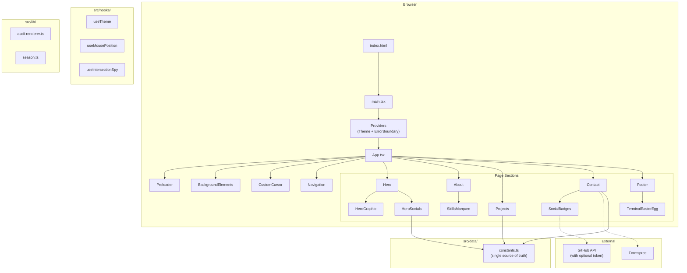
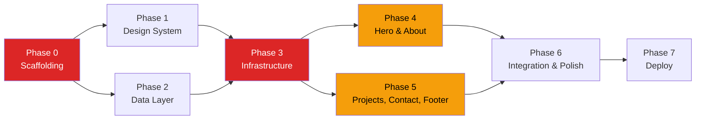

# TASKS.md — From-Scratch Rebuild Plan

> Based on audit in [ARCHITECTURE.md](file:///d:/Portfolio/ARCHITECTURE.md)  
> Generated: 2026-06-26

---

## Target Architecture

### Stack Decision: Keep vs. Change

| Layer | Current | Proposed | Change? | Rationale |
|-------|---------|----------|---------|-----------|
| Language | TypeScript ^5.2.2 | TypeScript ^5.x (latest) | Minor bump | Stay current |
| UI | React ^18.2.0 | React ^18.x or ^19 | Optional bump | No breaking changes needed |
| Build | Vite ^5.0.8 | Vite ^6.x (latest) | **Upgrade** | Better performance, stable |
| CSS | Tailwind ^3.3.6 | Tailwind ^3.4+ | Minor bump | Stay on v3 — v4 is too new for the plugin ecosystem |
| Animation | Framer Motion ^10 | Framer Motion ^11 (latest) | **Upgrade** | Better tree-shaking, smaller bundle |
| Smooth Scroll | Lenis ^1.3.18 | Lenis ^1.x (latest) | Keep | Works well |
| Particles | tsparticles ^3.x | tsparticles ^3.x | Keep | Works, but consider lazy-loading |
| Icons | Lucide + react-icons | Lucide only | **Simplify** | Two icon libraries is redundant; Lucide covers all needs except brand logos |

### Key Structural Changes

1. **Remove all Astro remnants** — no `.astro` files, no `AppWrapper.tsx`, no `astro.config.mjs`
2. **Remove unused deps** — `embla-carousel-react`, `canvas-confetti`, `react-google-recaptcha` and their `@types/`
3. **Remove dead components** — `MagicName.tsx`, `MagneticButton.tsx` (or integrate them if desired)
4. **Extract constants** — all hardcoded personal data into a single `src/data/constants.ts` file
5. **Add a `src/hooks/` directory** for extracted custom hooks (theme, intersection, mouse tracking)
6. **Add an `src/lib/` directory** for shared utilities (ASCII renderer, seasonal logic)
7. **Add `VITE_GITHUB_TOKEN` support** to SocialBadges for authenticated API calls
8. **Optimize image** — convert 1MB JPEG to WebP, add responsive sizes, rename to a human-readable filename
9. **Add error boundary** at the app level
10. **Integrate reCAPTCHA** or remove the dependency — currently installed but unused

### Proposed Architecture Diagram

---

## Phased Task Plan

### Phase 0: Project Scaffolding & Tooling ⚡ CRITICAL PATH

> **Done when:** `npm run dev` opens a blank page with no errors, Tailwind is working, TypeScript compiles cleanly, ESLint passes.

- [ ] Initialize new Vite + React + TypeScript project via `npm create vite@latest`
- [ ] Install and configure Tailwind CSS v3 + PostCSS + Autoprefixer
- [ ] Set up `tailwind.config.js` with `darkMode: 'class'` and custom brand colors (purple palette)
- [ ] Create `src/index.css` with Tailwind directives, global base styles, retro scrollbar, and CRT scanline overlay
- [ ] Configure TypeScript (`tsconfig.json`) with strict mode and path aliases
- [ ] Set up ESLint with React + TypeScript plugins
- [ ] Create `.env.example` with `VITE_GITHUB_TOKEN` and `VITE_FORMSPREE_ID`
- [ ] Create `.gitignore` and `.vercelignore`
- [ ] Add a basic `README.md` with accurate project description

**All tasks are blocking — must be done sequentially.**

---

### Phase 1: Design System & Shared Utilities

> **Done when:** All reusable CSS classes (`.retro-card`, `.retro-btn`, `.text-shadow-retro`, `.glitch-hover`, `.terminal-cursor`) and animation keyframes are defined and visually verified in a test page.

- [ ] Define all custom Tailwind animations and keyframes in `tailwind.config.js` (float, glow, scroll, bounce-slow, rotate-slow, shimmer-loading, slide-in, fade-in, ping-custom)
- [ ] Define custom box-shadow tokens (premium-glass, premium-hover)
- [ ] Build `.retro-card` utility class with hover lift effect
- [ ] Build `.retro-btn` utility class with press effect
- [ ] Build `.text-shadow-retro` utility
- [ ] Build `.glitch-hover` CSS animation (pseudo-element based)
- [ ] Build `.terminal-cursor` and `.terminal-cursor-focus` blinking block animation
- [ ] Create `src/lib/season.ts` — extract season detection logic from SeasonalBackground
- [ ] Create `src/lib/ascii-renderer.ts` — extract canvas-to-ASCII conversion from AsciiImage

**Parallelizable: CSS work and lib extractions can happen simultaneously.**

---

### Phase 2: Data Layer & Constants

> **Done when:** A single `constants.ts` is the source of truth for all personal data, and changing an email/link there changes it everywhere.

- [ ] Create `src/data/constants.ts` with personal info (name, email, GitHub username, LinkedIn URL, location, university, degree, skills, experience)
- [ ] Create `src/data/projects.ts` with project data (migrated from `githubData.ts` + inline Card-Game entry)
- [ ] Define TypeScript interfaces: `PersonalInfo`, `Project`, `Skill`, `Experience`, `ContactInfo`
- [ ] Remove all hardcoded duplications from component files (currently in Contact.tsx, HeroSocials.tsx, SocialBadges.tsx, About.tsx, AnimatedHeroGraphic.tsx)

**All tasks are blocking — interfaces must be defined before components import them.**

---

### Phase 3: Core Infrastructure Components ⚡ CRITICAL PATH

> **Done when:** Theme toggle, smooth scroll, preloader, background effects, and custom cursor all work independently.

- [ ] Build `src/contexts/ThemeContext.tsx` — theme provider with localStorage persistence + system preference detection
- [ ] Build `src/hooks/useTheme.ts` — extract the `useContext` hook
- [ ] Build `src/components/Preloader.tsx` — shutter animation with 1200ms timer
- [ ] Build `src/components/CustomCursor.tsx` — magnetic snap cursor with hover detection
- [ ] Build `src/components/BackgroundElements.tsx` — mouse-tracking ambient glow orbs
- [ ] Build `src/components/SeasonalBackground.tsx` — tsparticles with season detection (import from `src/lib/season.ts`)
- [ ] Build `src/components/Navigation.tsx` — desktop top bar + mobile bottom dock, IntersectionObserver section spy, scroll progress bar, theme toggle button
- [ ] Wire up `App.tsx` shell — Lenis init, render Preloader + BackgroundElements + CustomCursor + Navigation
- [ ] Wire up `main.tsx` entry — ThemeProvider + SeasonalBackground + App

**Navigation is the hardest component here — it has desktop/mobile variants, active section tracking, and scroll progress. Start it early.**

---

### Phase 4: Section Components — Hero & About

> **Done when:** Hero section renders with animated name, scramble text, social links, and ASCII art card. About section shows experience cards and skill tags with marquee.

- [ ] Build `src/components/ScrambleText.tsx` — character-by-character reveal with random chars
- [ ] Build `src/components/TextReveal.tsx` — word-by-word spring animation on viewport entry
- [ ] Build `src/components/AsciiImage.tsx` — canvas renderer with bare/standalone modes and 3D tilt (use extracted lib)
- [ ] Build `src/components/AnimatedHeroGraphic.tsx` — retro window chrome wrapping AsciiImage + data readout panel
- [ ] Build `src/components/HeroSocials.tsx` — GitHub/LinkedIn/Email icon links with hover glow (read URLs from constants)
- [ ] Build `src/components/Hero.tsx` — compose all hero sub-components, draggable name letters, parallax mouse tracking
- [ ] Build `src/components/LogoLoop.tsx` — rAF-based infinite scroll engine with pause-on-hover
- [ ] Build `src/components/SkillsMarquee.tsx` — skill icons feeding LogoLoop (use react-icons for brand logos)
- [ ] Build `src/components/About.tsx` — experience cards, skill categories, "My Approach" section, parallax

**LogoLoop is complex (487 lines) — budget extra time. AsciiImage is the second riskiest component.**

---

### Phase 5: Section Components — Projects, Contact, Footer

> **Done when:** Projects show in bento grid with retro window chrome. Contact form submits to Formspree. Footer renders with terminal easter egg.

- [ ] Build `src/components/SpotlightCard.tsx` — 3D tilt wrapper with mouse-tracking spotlight
- [ ] Build `src/components/Projects.tsx` — bento grid with retro window title bars, language color dots, star/fork counts, drag-to-rearrange, "View All on GitHub" link (read from constants/projects)
- [ ] Build `src/components/SocialBadges.tsx` — LinkedIn card + GitHub profile card (fetch GitHub API, read LinkedIn from constants)
- [ ] Build `src/components/Contact.tsx` — form with Formspree POST, contact info cards, education card, retro marquee, SocialBadges
- [ ] Build `src/components/TerminalEasterEgg.tsx` — interactive terminal with command handling (help, about, skills, contact, clear, secret)
- [ ] Build `src/components/Footer.tsx` — END banner, terminal easter egg, "SYSTEM HALTED" text

**Contact form Formspree integration should be tested early with a real submission.**

---

### Phase 6: Integration, Polish & Optimization

> **Done when:** All sections render correctly on desktop and mobile, smooth scroll works end-to-end, no console errors, Lighthouse score > 90 on Performance.

- [ ] Assemble full page in `App.tsx` — all sections in order
- [ ] Optimize profile image: convert to WebP, resize to max 600px width, rename to `profile.webp`
- [ ] Add responsive image `srcset` if needed
- [ ] Lazy-load SeasonalBackground (tsparticles is heavy — use `React.lazy()`)
- [ ] Lazy-load AsciiImage component
- [ ] Add React Error Boundary wrapper around App
- [ ] Test all Framer Motion animations at 60fps — profile with Chrome DevTools
- [ ] Test dark/light mode toggle on all sections
- [ ] Test mobile viewport: navigation dock, touch interactions, no horizontal overflow
- [ ] Test contact form submission end-to-end
- [ ] Verify GitHub API fetch works (and gracefully handles rate limiting)
- [ ] Remove any leftover dead code from build

---

### Phase 7: Deployment

> **Done when:** Site is live on Vercel at a custom domain, builds pass in CI, no 404s.

- [ ] Run `npm run build` — fix any TypeScript errors
- [ ] Test production build locally with `npm run preview`
- [ ] Push to GitHub
- [ ] Connect GitHub repo to Vercel
- [ ] Configure environment variables in Vercel dashboard (`VITE_FORMSPREE_ID`, optionally `VITE_GITHUB_TOKEN`)
- [ ] Verify deployment works at Vercel URL
- [ ] (Optional) Configure custom domain

---

## Risk-First Ordering

The following tasks are the **riskiest or most uncertain** and should be tackled first within their phases:

### 🔴 Risk 1: LogoLoop Infinite Scroll Engine
**Phase 4 · Complexity: High · 487 lines**

This is a custom animation engine using `requestAnimationFrame`, exponential smoothing, dynamic copy count calculation, and ResizeObserver. It's the most complex component in the codebase. If the rebuild breaks this, the skills section looks dead.

**Recommendation:** Port this early in Phase 4. Write it as a standalone component and test it in isolation before integrating into SkillsMarquee.

### 🔴 Risk 2: Navigation (Desktop + Mobile + Section Spy)
**Phase 3 · Complexity: High · 238 lines**

Has two completely different layouts (desktop top bar, mobile bottom dock), an IntersectionObserver-based active section tracker, a scroll progress bar, hover pill animation with `layoutId`, and a theme toggle. Lots of moving parts.

**Recommendation:** Build desktop nav first, then mobile, then add section spy. Test each independently.

### 🟡 Risk 3: AsciiImage Canvas Rendering
**Phase 4 · Complexity: Medium · 164 lines**

Uses `<canvas>` for pixel-level image processing — brightness calculation, character mapping, cross-origin image loading. Has two render modes (bare vs. standalone). Edge cases around image load failures and CORS.

**Recommendation:** Test with the actual profile image early. Verify CORS works when served from Vite dev server vs. production CDN.

---

## Dependency Graph (What Blocks What)

- **Red = Critical path** (blocking everything downstream)
- **Yellow = Parallelizable** (Phase 4 and Phase 5 can happen simultaneously)
- Phase 1 and Phase 2 are also parallelizable with each other

---

## Estimated Timeline

| Phase | Est. Duration | Parallelizable? |
|-------|--------------|-----------------|
| Phase 0: Scaffolding | 0.5 days | No |
| Phase 1: Design System | 1 day | Yes (with Phase 2) |
| Phase 2: Data Layer | 0.5 days | Yes (with Phase 1) |
| Phase 3: Infrastructure | 2 days | No (blocked by 0+1+2) |
| Phase 4: Hero & About | 2-3 days | Yes (with Phase 5) |
| Phase 5: Projects/Contact/Footer | 2 days | Yes (with Phase 4) |
| Phase 6: Integration & Polish | 1-2 days | No |
| Phase 7: Deploy | 0.5 days | No |
| **Total** | **~8-10 days** (single person) | |
